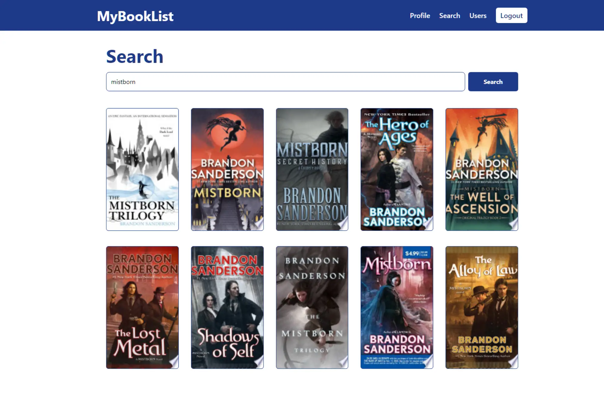
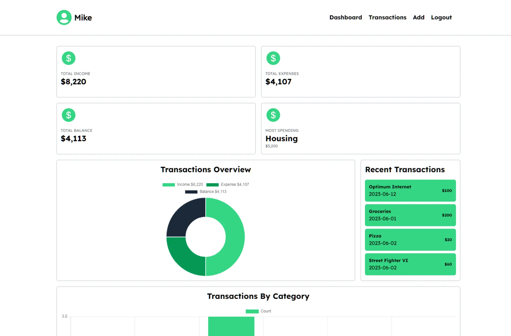
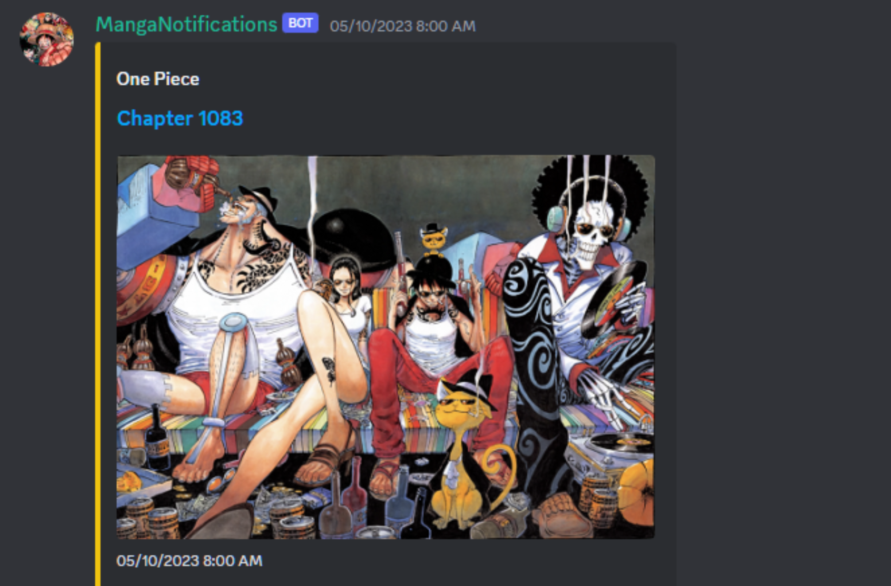

 
    
    
    

Hi, I'm Marcos. I'm a full stack software engineer who loves building web applications and was born and raised in the NYC area. I am always seeking new opportunities to apply my skills and grow as a developer, feel free to reach me at [marcosgonzalez1731@gmail.com](mailto:marcosgonzalez1731@gmail.com)

See [my portfolio](https://marcosgonzalez.dev/) for more information!

<h1 align="center">Projects</h1>

<table>
    <tr>
        <td width="50%" valign="top">
            <h3 align="center">MyBookList</h3>
            
             
             
            

                
                <h4 align="center">JavaScript, React, Tailwind CSS, C#, ASP.NET, Microsoft SQL Server</h4>
                
A full-stack web application that allows you to organize and track all the books you have read or want to read.

            

        </td>
        <td width="50%" valign="top">
            <h3 align="center">Expense Tracker</h3>
            
             
             
            

                
                <h4 align="center">TypeScript, React, Tailwind CSS, Java, Spring Boot, PostgreSQL</h4>
                
A full-stack web application where users can manage, track, and visualize all of their transactions.

            

        </td>
    </tr>
    <tr>
        <td width="50%" valign="top">
            <h3 align="center">MangaNotifications</h3>
            
             
             
            

                
                <h4 align="center">JavaScript, Node.js, MongoDB</h4>
                
A self-hosted discord bot that allows users to track a series and receive notifications when new chapters are released.

            

        </td>
        <td width="50%" valign="top">
            <h3 align="center">Video Game Sales Data Analysis</h3>
            
             
             
            

                
                <h4 align="center">Python, Jupyter Notebook</h4>
                
An analysis of a dataset that contains video game sales information to gain an understanding of the video game market.

            

        </td>
    </tr>
</table>

<h1 align="center">Technologies</h1>

    
    
    
    
    
    
    
    
    
    
    
    
    
    
    
    
    
    

<h1 align="center">Connect</h1>

 
    
    

