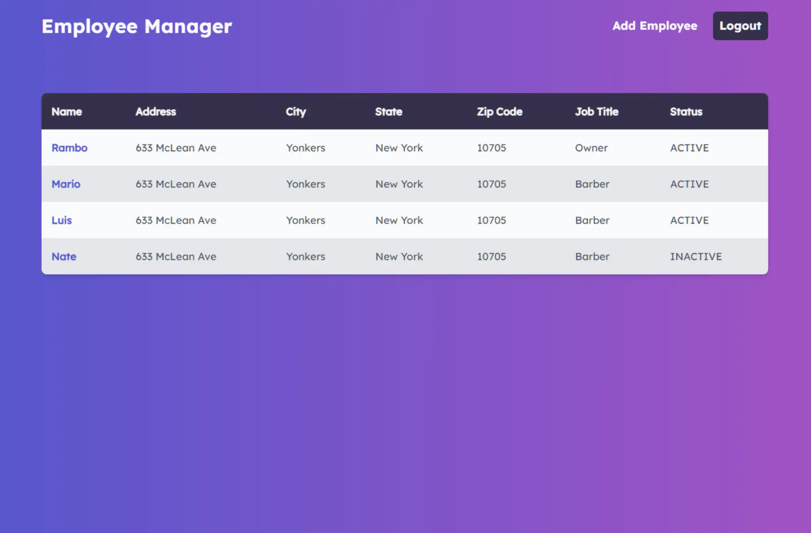
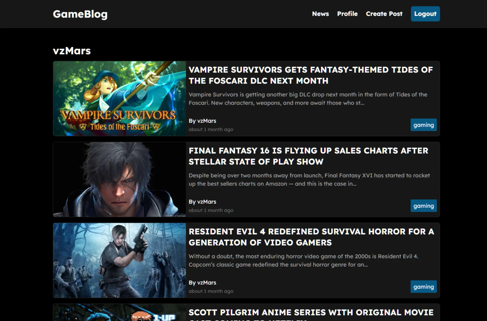

 
    
    
    
    

Hi, I'm Marcos. I'm a full stack software engineer who loves building web applications and was born and raised in the NYC area. I am always seeking new opportunities to apply my skills and grow as a developer, feel free to reach me at [marcosgonzalez1731@gmail.com](mailto:marcosgonzalez1731@gmail.com).

See [my portfolio](https://marcosgonzalez.dev/) for more information!

<h1 align="center">Projects</h1>

<table bordercolor="#66b2b2">
  
  <tr>
    <td width="50%" valign="top">
      <h3 align="center">Employee Manager</h3>
        
         
        

          
        
      

        
<strong>Javascript, Bootstrap, Sass, Node.js, & Express.js</strong> - Platform to help build momentous milestones along with your friends and family! Travelara makes Dream Trips a Reality!

    </td>
    <td width="50%" valign="top">
      <h3 align="center">Expense Tracker</h3>
      
        

          
  
  
      

        
<strong>Javascript & Phaser.js</strong> - The awaited sequel sees our Rigley friend jumping through firewalls "Flappy Bird" style.

    </td>
  </tr>
  
  <tr>
    <td width="50%" valign="top">
      <h3 align="center">MyBookList</h3>
        
        

  
  
      

        
<strong>HTML5, CSS3, & Javascript</strong> - Portfolio Site including links to my projects and ways to get in contact with me.

    </td>
    <td width="50%" valign="top">
      <h3 align="center">GameBlog</h3>
        
        

          
  
  
      

        
<strong>HTML5, CSS3, & Javascript</strong> - With over 100 different cards, test your memory in these three popular trading card themes, Pokemon, Yugioh, & Magic: The Gathering!

    </td>
  </tr>
</table>

<h1 align="center">Technologies</h1>

<h1 align="center">Connect</h1>

 
    
    
    
    

